# Project Introduction

Heima Mall is an e-commerce shopping mall system developed based on the most popular microservices architecture today, designed to provide users with an efficient and smooth shopping experience.

# Microservices

## Monolithic Architecture

Monolithic architecture: As the name suggests, all functional modules in the project are developed within a single codebase;
When deploying the project, all modules need to be compiled and packaged together; the architecture design and development model are very simple.<br>

<div align=center>
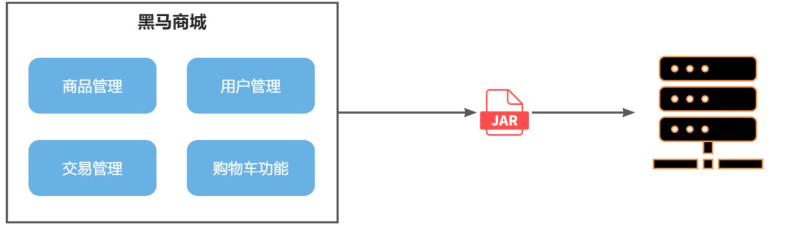
</div>
When the project scale is small, this model is easy to get started with, and deployment and operations are convenient, so many early small projects adopted this pattern.<br>
However, as the project's business scale grows larger and the development team increases, monolithic architecture presents more and more problems:<br>

- High team collaboration costs: Imagine dozens of people in your team collaborating on the same project simultaneously. Since all modules are in one project, the physical boundaries between different modules' code become increasingly blurred. Eventually, when merging features into a single branch, you will absolutely get stuck in the quagmire of conflict resolution.<br>
- Low system release efficiency: Any module change requires releasing the entire system, and the system release process involves many constraints between multiple modules, requiring comparison of various files. Any single issue can cause release failure, and often one release takes tens of minutes or even hours.<br>
- Poor system availability: In monolithic architecture, each functional module is deployed as a single service, and they affect each other. Some hotspot features can exhaust system resources, causing other services to become less available.<br>

To solve these problems, we need to use a microservices architecture.<br>

## Microservices Architecture

Microservices architecture is first and foremost about service-oriented design, which means splitting functional modules from the monolithic application and deploying them independently as multiple services. At the same time, it must meet the following characteristics:<br>

- Single Responsibility: One microservice is responsible for a portion of business functionality, and its core data does not depend on other modules.<br>
- Team Autonomy: Each microservice has its own independent development, testing, release, and operations personnel, with team size not exceeding 10 people (two pizzas can feed them)<br>
- Service Autonomy: Each microservice is independently packaged and deployed, accessing its own independent database. And proper service isolation must be done to avoid impacting other services<br>
<div align=center>
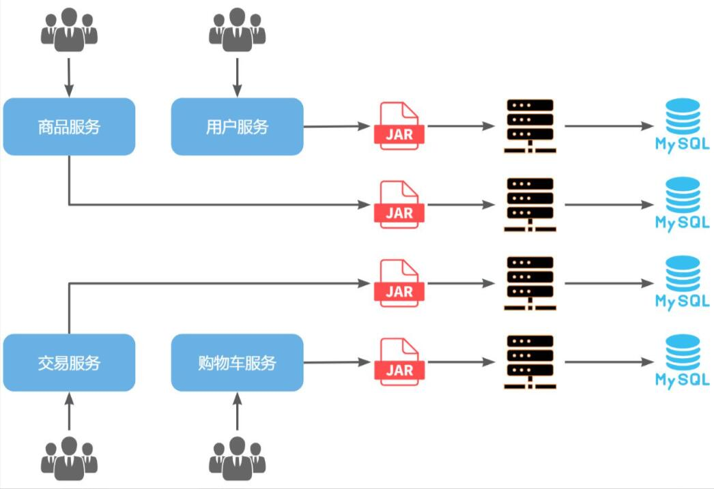<br>
</div>

# Project Overall Architecture

<div align=center>
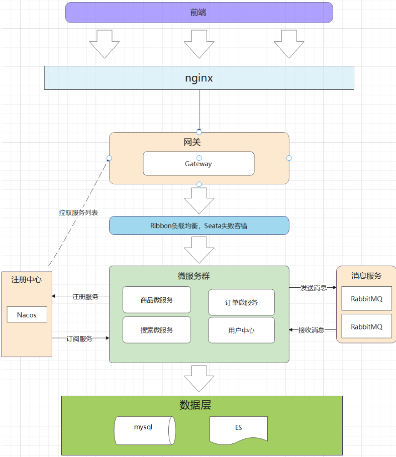
</div>

# Key Technologies Summary

## MybatisPlus

MybatisPlus: In daily development, you should notice that single-table CRUD functionality has high code repetition and little complexity.
The code volume for this part is often large and time-consuming to develop.
Therefore, enterprises currently use some components to simplify or omit single-table CRUD development work.
One of the most widely used components in China is MybatisPlus.<br>

<div align=center>
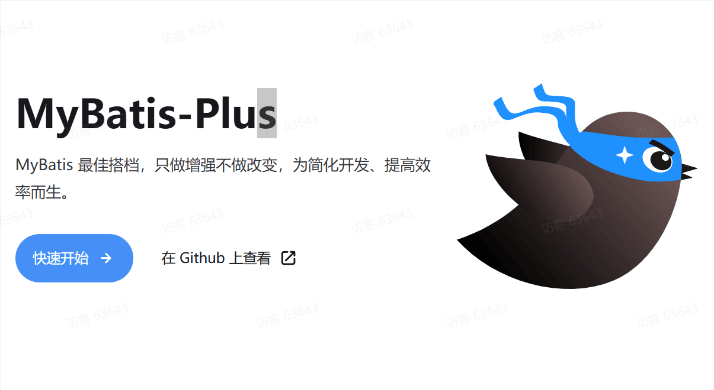
</div>

### Defining Mapper

To simplify single-table CRUD, MybatisPlus provides a basic BaseMapper interface that already implements single-table CRUD:<br>

<div align=center>
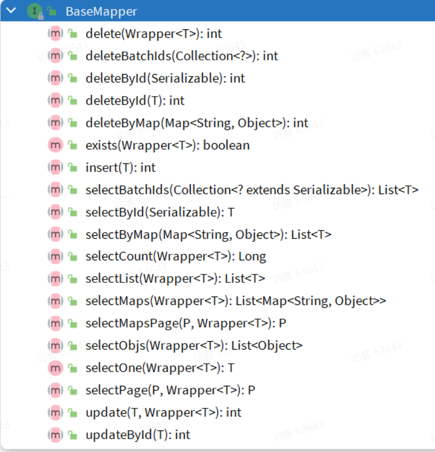<br>
</div>

Specific code examples:

```java
import com.baomidou.mybatisplus.core.mapper.BaseMapper;
import com.itheima.mp.domain.po.User;

public interface UserMapper extends BaseMapper<User> {
}
```

```java
    @Autowired
    private UserMapper userMapper;

    @Test
    void testInsert() {
        User user = new User();
        user.setId(5L);
        user.setUsername("Lucy");
        user.setPassword("123");
        user.setPhone("18688990011");
        user.setBalance(200);
        user.setInfo("{\"age\": 24, \"intro\": \"English Teacher\", \"gender\": \"female\"}");
        user.setCreateTime(LocalDateTime.now());
        user.setUpdateTime(LocalDateTime.now());
        userMapper.insert(user);
    }

    @Test
    void testSelectById() {
        User user = userMapper.selectById(5L);
    }

    @Test
    void testSelectByIds() {
        List<User> users = userMapper.selectBatchIds(List.of(1L, 2L, 3L, 4L, 5L));
    }

    @Test
    void testUpdateById() {
        User user = new User();
        user.setId(5L);
        user.setBalance(20000);
        userMapper.updateById(user);
    }

    @Test
    void testDelete() {
        userMapper.deleteById(5L);
    }
```

### Condition Wrapper

In addition to insertion, update, delete, and query SQL statements all need to specify where conditions.
Therefore, the related methods provided in BaseMapper, besides using id as the where condition, also support more complex where conditions.<br>

#### QueryWrapper

Query: Query people whose name contains 'o' and whose balance is greater than or equal to 1000. The code is as follows:

```java
@Test
void testQueryWrapper() {
    // 1. Build query condition where name like "%o%" AND balance >= 1000
    QueryWrapper<User> wrapper = new QueryWrapper<User>()
            .select("id", "username", "info", "balance")
            .like("username", "o")
            .ge("balance", 1000);
    // 2. Query data
    List<User> users = userMapper.selectList(wrapper);
    users.forEach(System.out::println);
}
```

Update: Update the balance of the user with username "jack" to 2000, the code is as follows:

```java
@Test
void testUpdateByQueryWrapper() {
    // 1. Build query condition where name = "Jack"
    QueryWrapper<User> wrapper = new QueryWrapper<User>().eq("username", "Jack");
    // 2. Update data, non-null fields in user will be used as set statements
    User user = new User();
    user.setBalance(2000);
    userMapper.update(user, wrapper);
}
```

#### UpdateWrapper

When updating using the update method in BaseMapper, direct assignment can only be done, making it difficult to implement some complex requirements.<br>
For example: Update the balance of users with ids 1, 2, and 4, deducting 200, the corresponding SQL should be:

```mysql
UPDATE user SET balance = balance - 200 WHERE id in (1, 2, 4)
```

At this point, we need to use the setSql function in UpdateWrapper:

```java
@Test
void testUpdateWrapper() {
    List<Long> ids = List.of(1L, 2L, 4L);
    // 1. Generate SQL
    UpdateWrapper<User> wrapper = new UpdateWrapper<User>()
            .setSql("balance = balance - 200") // SET balance = balance - 200
            .in("id", ids); // WHERE id in (1, 2, 4)
        // 2. Update, note that the first parameter can be null, meaning no update fields and data,
    // but update based on setSQL in UpdateWrapper
    userMapper.update(null, wrapper);
}
```

### Service Interface

MybatisPlus not only provides BaseMapper but also provides general Service interfaces and default implementations, encapsulating some commonly used service template methods.<br>

```java
public interface IUserService extends IService<User> {
    // Extend custom methods
}
```

```java
@Service
public class UserServiceImpl extends ServiceImpl<UserMapper, User> implements IUserService {

}
```

```java
    private final IUserService userService;

    @PostMapping
    @ApiOperation("Add User")
    public void saveUser(@RequestBody UserFormDTO userFormDTO){
        // 1. Convert DTO to PO
        User user = BeanUtil.copyProperties(userFormDTO, User.class);
        // 2. Add
        userService.save(user);
    }

    @DeleteMapping("/{id}")
    @ApiOperation("Delete User")
    public void removeUserById(@PathVariable("id") Long userId){
        userService.removeById(userId);
    }

    @GetMapping("/{id}")
    @ApiOperation("Query User by ID")
    public UserVO queryUserById(@PathVariable("id") Long userId){
        // 1. Query user
        User user = userService.getById(userId);
        // 2. Process VO
        return BeanUtil.copyProperties(user, UserVO.class);
    }

    @GetMapping
    @ApiOperation("Query Users by ID Collection")
    public List<UserVO> queryUserByIds(@RequestParam("ids") List<Long> ids){
        // 1. Query users
        List<User> users = userService.listByIds(ids);
        // 2. Process VO
        return BeanUtil.copyToList(users, UserVO.class);
    }
```

## Docker

Microservices projects often involve dozens or hundreds of services that need to be deployed, and some large projects even reach tens of thousands of services.
However, because each server's operating environment is different, written installation procedures and deployment scripts may not work properly on every server,
often resulting in errors. This brings many difficulties to system deployment and operations.<br>
So, is there a technology that can avoid deployment dependencies on server environments and reduce complex deployment processes?<br>
The answer is yes, and that is Docker technology. With Docker, project deployment is as smooth as silk, greatly reducing operations workload.
Even if you are not familiar with Linux, you can easily deploy various common software and Java projects.<br>

### Docker Deployment

Docker itself includes a background service. We can use Docker commands to tell the Docker service
to help us quickly deploy specified applications. When the Docker service deploys an application, it first searches for and downloads the corresponding image for the application,
then creates and runs containers based on the image, and the application deployment is complete.<br>

<div align=center>
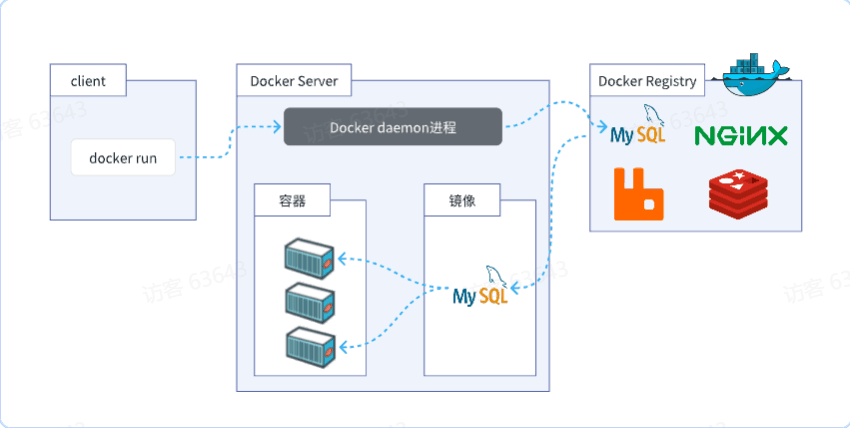<br>
</div>

### Common Docker Commands and Relationships

<div align=center>
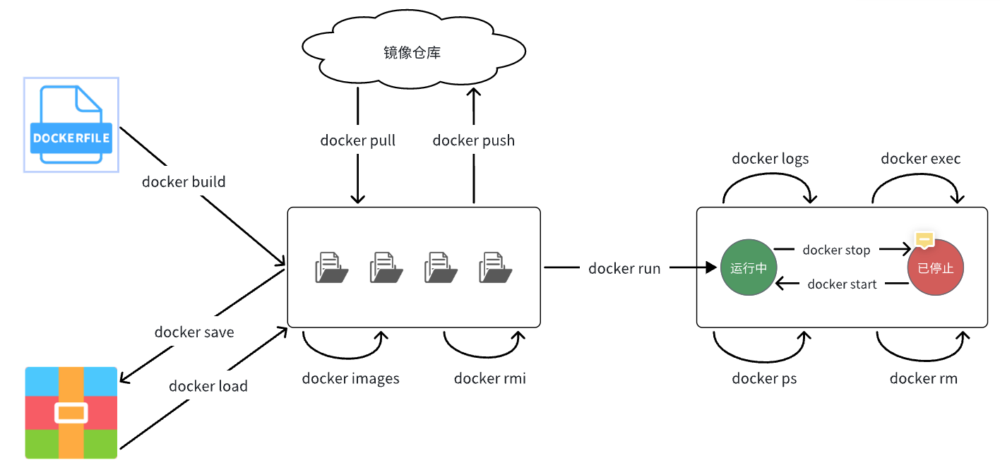<br>
</div>

## SpringCloud

The various problems encountered after microservices splitting have corresponding solutions and microservice components,
and the SpringCloud framework can be said to be the most comprehensive collection of microservice components in the Java field currently.
In addition, Alibaba's microservices product SpringCloudAlibaba has also become a member of the SpringCloud components.<br>

<div align=center>
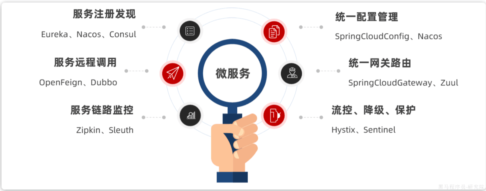<br>
</div>

## RestTemplate

Cross-service calls: Spring provides us with a RestTemplate API that can conveniently implement HTTP request sending.<br>
The basic steps for sending HTTP requests in Java using Spring's RestTemplate are as follows:<br>

- Register RestTemplate with the Spring container
- Call RestTemplate's API to send requests. Common methods include:
  - getForObject: Send GET request and return object of specified type
  - postForObject: Send POST request and return object of specified type
  - put: Send PUT request
  - delete: Send DELETE request
  - exchange: Send any type of request, return ResponseEntity

```java
    ResponseEntity<List<ItemDTO>> response = restTemplate.exchange(
            "http://localhost:8081/items?ids={ids}",
            HttpMethod.GET,
            null,
            new ParameterizedTypeReference<List<ItemDTO>>() {
            },
            Map.of("ids", CollUtil.join(itemIds, ","))
    );
    // 2.2. Parse response
    if(!response.getStatusCode().is2xxSuccessful()){
        // Query failed, exit directly
        return;
    }
    List<ItemDTO> items = response.getBody();
```

## Nacos Service Registry

In large microservices projects, the number of service providers is very large. To manage these services, the concept of a service registry was introduced. The relationship between the service registry, service providers, and service consumers is as follows:<br>

<div align=center>
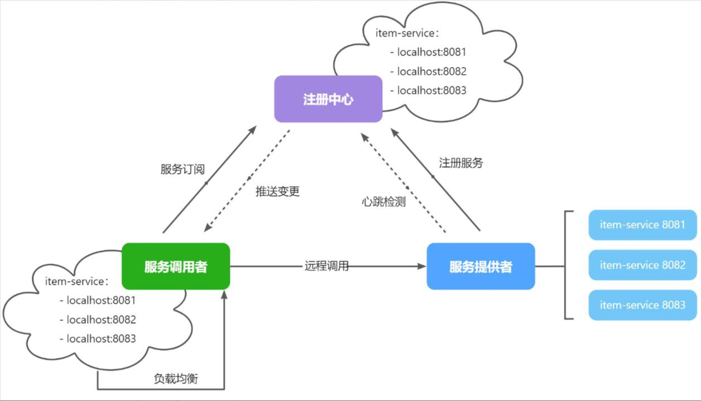<br>
</div>

The process is as follows:

- When services start, they register their service information (service name, IP, port) with the service registry
- Callers can subscribe to desired services from the service registry and obtain the list of service instances (1 service may be deployed on multiple instances)
- The caller performs load balancing on the instance list and selects one instance
- The caller initiates a remote call to that instance

Service callers must use load balancing algorithms to select one instance from multiple instances to access. Common load balancing algorithms include:

- Random
- Round Robin
- IP Hash
- Least Recently Used

Additionally, service discovery requires a tool, DiscoveryClient, which SpringCloud has already auto-assembled for us, and we can inject and use it directly.<br>

```java
List<ServiceInstance> instances = discoveryClient.getInstances("item-service");
if (CollUtil.isEmpty(instances)){
    return;
}
ServiceInstance instance = instances.get(RandomUtil.randomInt(instances.size()));

// Obtain product information from itemservice through network request
ResponseEntity<List<ItemDTO>> response = restTemplate.exchange(
        instance.getUri()+"/items?ids={ids}",
        HttpMethod.GET,
        null,
        new ParameterizedTypeReference<List<ItemDTO>>() {
        },
        Map.of("ids", CollUtil.join(itemIds, ","))
);
```

## OpenFeign

Using Nacos for service governance and RestTemplate for remote service calls. However, the remote call code is too complex.
Therefore, we must find a way to change the remote call development model to make remote calls as simple as local method calls. And this requires the OpenFeign component.
Actually, the key points of remote calls are four:

- Request method
- Request path
- Request parameters
- Return type

So, OpenFeign uses SpringMVC-related annotations to declare these 4 parameters, then generates remote call code based on dynamic proxies, without manual coding, which is very convenient.<br>

```java
@FeignClient("item-service")
public interface ItemClient {

    @GetMapping("/items")
    List<ItemDTO> queryItemByIds(@RequestParam("ids") Collection<Long> ids);
}
```

```java
// OpenFeign simplifies RestTemplate and Nacos technology
List<ItemDTO> items = itemClient.queryItemByIds(itemIds);
```

## Gateway

Since each microservice has different addresses or ports and different entry points, some problems were discovered when collaborating with the frontend:<br>

- When requesting different data, different entry points need to be accessed, requiring maintenance of multiple entry addresses, which is troublesome
- The frontend cannot call Nacos and cannot update the service list in real-time

In monolithic architecture, user login and identity verification only need to be completed once, and user information can be obtained in all business operations. After microservices splitting, each microservice is deployed independently, which raises some questions:

- Does each microservice need to implement login verification and user information retrieval?
- When microservices call each other, how should user information be passed?

Don't worry, these problems can all be solved through gateway technology.<br>
What is a gateway?<br>
As the name suggests, a gateway is the gateway of a network. When data is transmitted across networks,
from one network to another, it needs to go through the gateway for data routing and forwarding as well as data security verification.<br>
Now, the microservices gateway serves the same purpose. Frontend requests cannot directly access microservices but must request the gateway:<br>

- The gateway can perform security control, that is, login identity verification, only allowing passage after verification
- After authentication, the gateway determines which microservice the request should access based on the request and forwards the request

<div align=center>
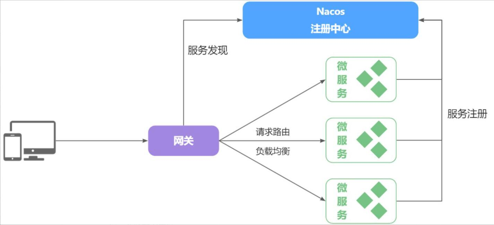<br>
</div>

In SpringCloud, two gateway implementation solutions are provided:<br>

- Netflix Zuul: Early implementation, now obsolete.<br>
- SpringCloudGateway: Based on Spring's WebFlux technology, fully supports reactive programming, with stronger throughput.<br>

### Configuring Routes

Combined with Nacos, you can access item-related services through port 8080.

```yaml
server:
  port: 8080
spring:
  cloud:
    nacos:
      server-addr: 192.168.***.***:8848
    gateway:
      routes:
        - id: item # Route rule id, custom, unique
          uri: lb://item-service # Target service for routing, lb represents load balancing, will pull service list from registry
          predicates: # Route assertions, determine if current request matches current rule, if match then route to target service
            - Path=/items/**,/search/** # Here using request path as judgment rule
```

### Gateway Login Verification

<div align=center>
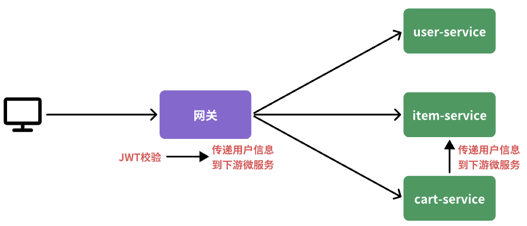<br>
</div>

#### Gateway Filter

As shown in the figure, the final request forwarding is executed by a filter named NettyRoutingFilter,
and this filter is the last one in the entire filter chain. If we can define a filter
that implements login verification logic and define the filter execution order before NettyRoutingFilter, this meets the requirement!

<div align=center>
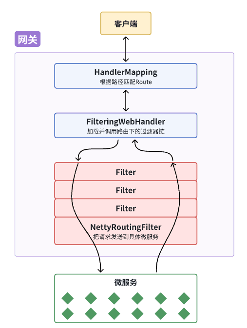<br>
</div>

```java
public Mono<Void> filter(ServerWebExchange exchange, GatewayFilterChain chain) {
    // 1. Get Request
    ServerHttpRequest request = exchange.getRequest();
    // 2. Determine if interception is not needed
    if(isExclude(request.getPath().toString())){
        // No need to intercept, allow direct passage
        return chain.filter(exchange);
    }
    // 3. Get token from request header
    String token = null;
    List<String> headers = request.getHeaders().get("authorization");
    if (!CollUtils.isEmpty(headers)) {
        token = headers.get(0);
    }
    // 4. Validate and parse token
    Long userId = null;
    try {
        userId = jwtTool.parseToken(token);
    } catch (UnauthorizedException e) {
        // If invalid, intercept
        ServerHttpResponse response = exchange.getResponse();
        response.setRawStatusCode(401);
        return response.setComplete();
    }

    // If valid, pass user information
    String userInfo = userId.toString();
    ServerWebExchange swe = exchange.mutate()
          .request(builder -> builder.header("user-info", userInfo))
          .build();
    // 6. Allow passage
    return chain.filter(swe);
}
```

Each microservice is configured with interceptors to verify the user ID for login verification.

```java
public class UserInfoInterceptor implements HandlerInterceptor {
    @Override
    public boolean preHandle(HttpServletRequest request, HttpServletResponse response, Object handler) throws Exception {
        // 1. Get user information from request header
        String userInfo = request.getHeader("user-info");
        // 2. Determine if empty
        if (StrUtil.isNotBlank(userInfo)) {
            // Not empty, save to ThreadLocal
                UserContext.setUser(Long.valueOf(userInfo));
        }
        // 3. Allow passage
        return true;
    }

    @Override
    public void afterCompletion(HttpServletRequest request, HttpServletResponse response, Object handler, Exception ex) throws Exception {
        // Remove user
        UserContext.removeUser();
    }
}
```

Within microservices, when using OpenFeign to call other microservices, user information also needs to be passed for verification.

```java
@Bean
public RequestInterceptor userInfoRequestInterceptor(){
    return new RequestInterceptor() {
        @Override
        public void apply(RequestTemplate template) {
            // Get logged-in user
            Long userId = UserContext.getUser();
            if(userId == null) {
                // If empty, skip directly
                return;
            }
            // If not empty, put in request header and pass to downstream microservice
            template.header("user-info", userId.toString());
        }
    };
}
```

## Sentinel

### Request Rate Limiting

Click the flow control button behind the cluster point link to configure rate limiting:

<div align=center>
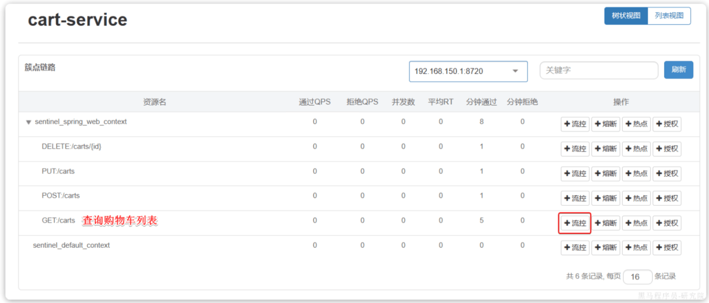<br>
</div>

Fill in the popup menu like this:<br>

<div align=center>
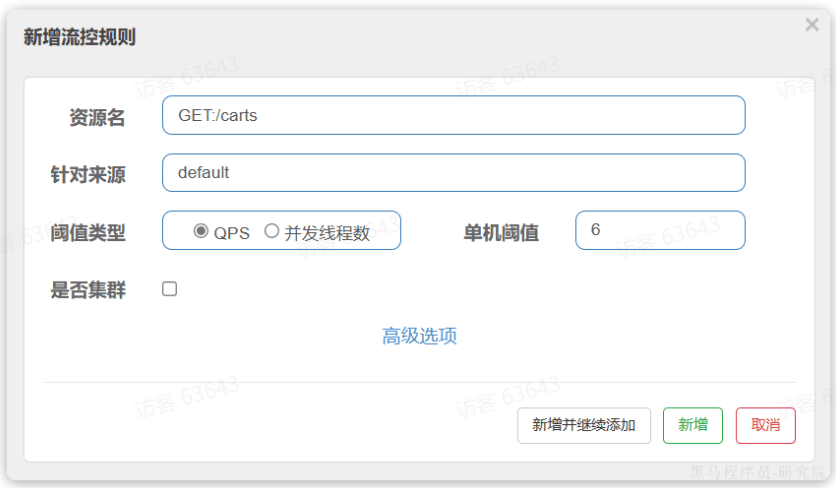<br>
</div>
This limits the query shopping cart list cluster point resource traffic to 6 per second, meaning the maximum QPS is 6.<br>

### Thread Isolation

When querying the shopping cart, product information needs to be queried. To avoid cascading failures of the shopping cart service due to product service failures,
we can isolate the product query part of the shopping cart business and limit available thread resources:<br>

<div align=center>
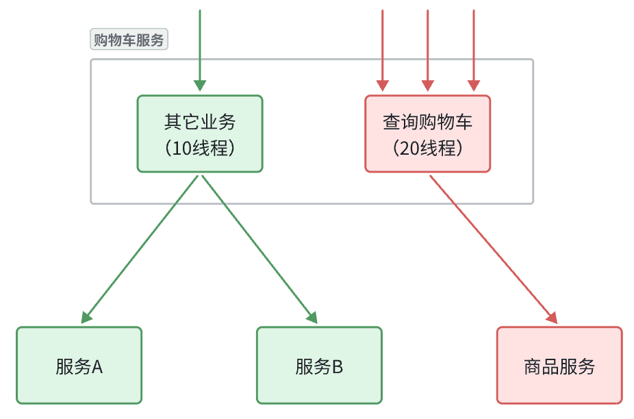<br>
</div>

#### OpenFeign Integration with Sentinel

```yaml
feign:
  sentinel:
    enabled: true # Enable feign support for sentinel
```

Click the flow control button behind the cluster point resource corresponding to the product query FeignClient:<br>

<div align=center>
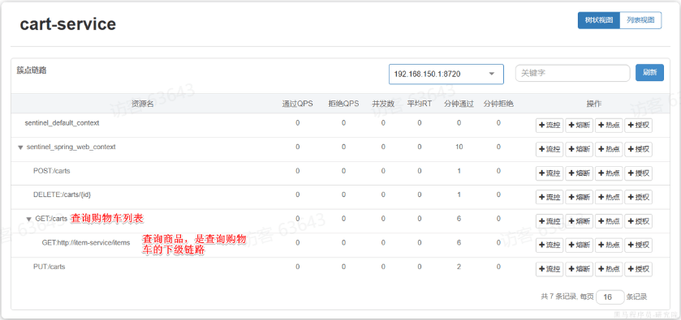<br>
</div>

<div align=center>
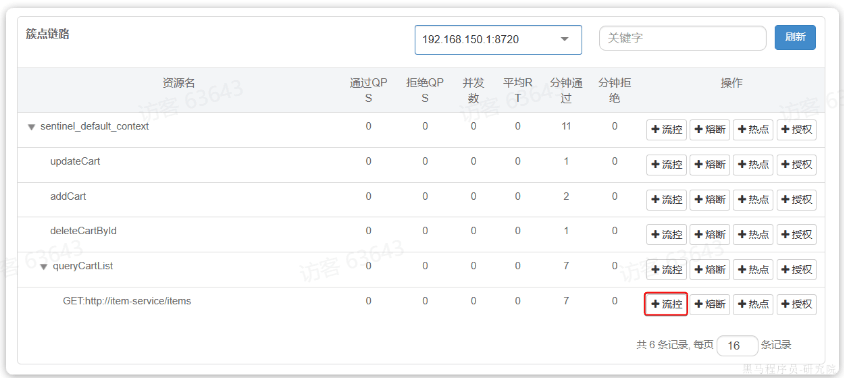<br>
</div>

Note that here the concurrent thread number limit is selected, meaning this query function can use at most 5 threads, not 5 QPS.
If the product query interface processes 2 requests per second, then the actual QPS of 5 threads is around 10, and excess requests will naturally be rejected.<br>

<div align=center>
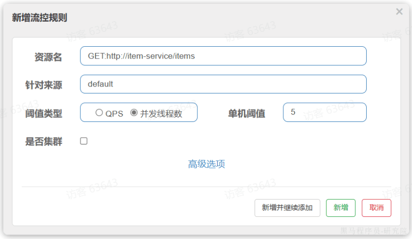<br>
</div>

## Seata - Distributed Transactions

There are three important roles in Seata's transaction management:<br>

- TC (Transaction Coordinator) - Transaction Coordinator: Maintains the status of global and branch transactions, coordinates global transaction commit or rollback.
- TM (Transaction Manager) - Transaction Manager: Defines the scope of global transactions, starts global transactions, commits or rolls back global transactions.
- RM (Resource Manager) - Resource Manager: Manages branch transactions, communicates with TC to register branch transactions and report branch transaction status, and drives branch transaction commit or rollback.

<div align=center>
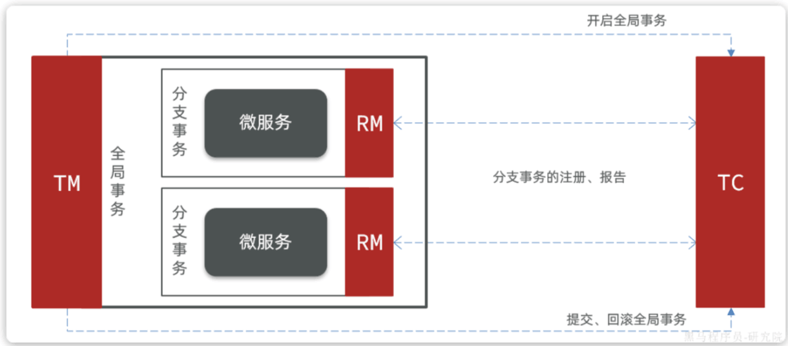<br>
</div>

Seata supports four different distributed transaction solutions:

- XA
- TCC
- AT
- SAGA

#### Seata's XA Model

Seata has made simple encapsulation and modification to the original XA mode to adapt to its own transaction model. The basic architecture is shown in the figure:<br>

<div align=center>
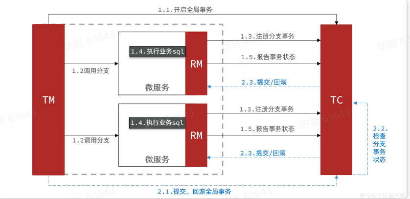<br>
</div>

RM Phase 1 Work:

1. Register branch transaction with TC
2. Execute branch business SQL but do not commit
3. Report execution status to TC

TC Phase 2 Work:

1. TC detects execution status of each branch transaction
1. If all successful, notify all RMs to commit transactions
1. If any failed, notify all RMs to rollback transactions

RM Phase 2 Work:

- Receive TC instructions, commit or rollback transactions

#### Seata's AT Model

The AT mode is also a two-phase commit transaction model, but it compensates for the flaw of the XA model's long resource locking period.<br>

<div align=center>
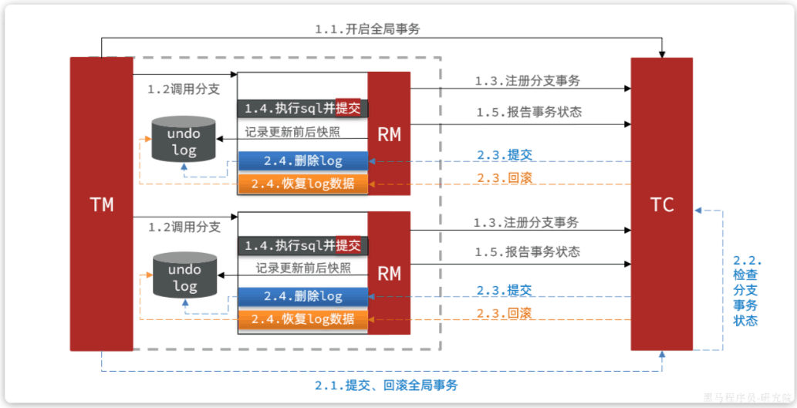<br>
</div>

Phase 1 RM Work:

- Register branch transaction
- Record undo-log (data snapshot)
- Execute business SQL and commit
- Report transaction status
  Phase 2 Commit RM Work:
- Delete undo-log only
  Phase 2 Rollback RM Work:
- Restore data to pre-update state based on undo-log

#### Differences Between AT and XA

Briefly describe the biggest difference between AT mode and XA mode?

- XA mode does not commit transactions in phase 1, locking resources; AT mode commits directly in phase 1, not locking resources.
- XA mode relies on database mechanisms for rollback; AT mode uses data snapshots for data rollback.
- XA mode is strongly consistent; AT mode is eventually consistent

It can be seen that AT mode is simpler to use, has no business intrusion, and has better performance. Therefore, 90% of distributed transactions in enterprises can be solved using AT mode.<br>

## RabbitMQ - Asynchronous Calls

The corresponding architecture of RabbitMQ is shown in the figure:<br>

<div align=center>
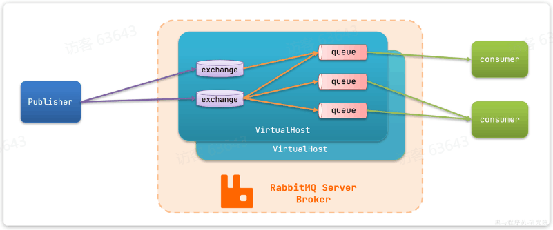<br>
</div>

It contains several concepts:

- publisher: Producer, that is, the party sending messages
- consumer: Consumer, that is, the party consuming messages
- queue: Queue, storing messages. Messages sent by producers are temporarily stored in message queues, waiting for consumers to process
- exchange: Exchange, responsible for message routing. Messages sent by producers are determined by the exchange which queue to deliver to.
- virtual host: Virtual host, serving the purpose of data isolation. Each virtual host is independent, with its own exchange and queue

### SpringAMQP

Since RabbitMQ uses the AMQP protocol, it has cross-language characteristics.
Any language that follows the AMQP protocol to send and receive messages can interact with RabbitMQ.
And RabbitMQ official also provides various clients for different languages.
However, the Java client provided by RabbitMQ official is relatively complex to code,
and in production environments, we more often combine it with Spring.
Spring official happens to provide a set of message sending and receiving template tools based on RabbitMQ:
SpringAMQP. And it implements auto-configuration based on SpringBoot, making it very convenient to use.<br>
Message sending:<br>

```java
@SpringBootTest
public class SpringAmqpTest {

    @Autowired
    private RabbitTemplate rabbitTemplate;

    @Test
    public void testSimpleQueue() {
        // Queue name
        String queueName = "simple.queue";
        // Message
        String message = "hello, spring amqp!";
        // Send message
        rabbitTemplate.convertAndSend(queueName, message);
    }
}
```

Message receiving:<br>

```java
@Component
public class SpringRabbitListener {
  // Use RabbitListener to declare queue information to listen to
  // Once messages appear in the listened queue in the future, they will be pushed to the current service, calling the current method to process the message.
  // You can see that what is received in the method body is the message body content
  @RabbitListener(queues = "simple.queue")
  public void listenSimpleQueueMessage(String msg) throws InterruptedException {
    System.out.println("Spring consumer received message: [" + msg + "]");
  }
}
```

## Elasticsearch

Elasticsearch is a very powerful open-source search engine that supports many features.

### Inverted Index

There are two very important concepts in inverted index:

- Document: The data used for searching, where each piece of data is a document. For example, a webpage, a product information
- Term: Using some algorithm to segment document data or user search data, obtaining meaningful words is a term. For example: I am Chinese, can be divided into: I, am, Chinese, China, country such several terms

Creating an inverted index is a special processing and application of the forward index. The process is as follows:

- Use the word segmentation algorithm to split each document's data based on semantics, obtaining individual terms
- Create a table, where each row of data includes term, document id where the term is located, position and other information
- Because of term uniqueness, a forward index can be created for terms

The search process of the inverted index is as follows (taking search for "Huawei phone" as an example), as shown in the figure:<br>

<div align=center>
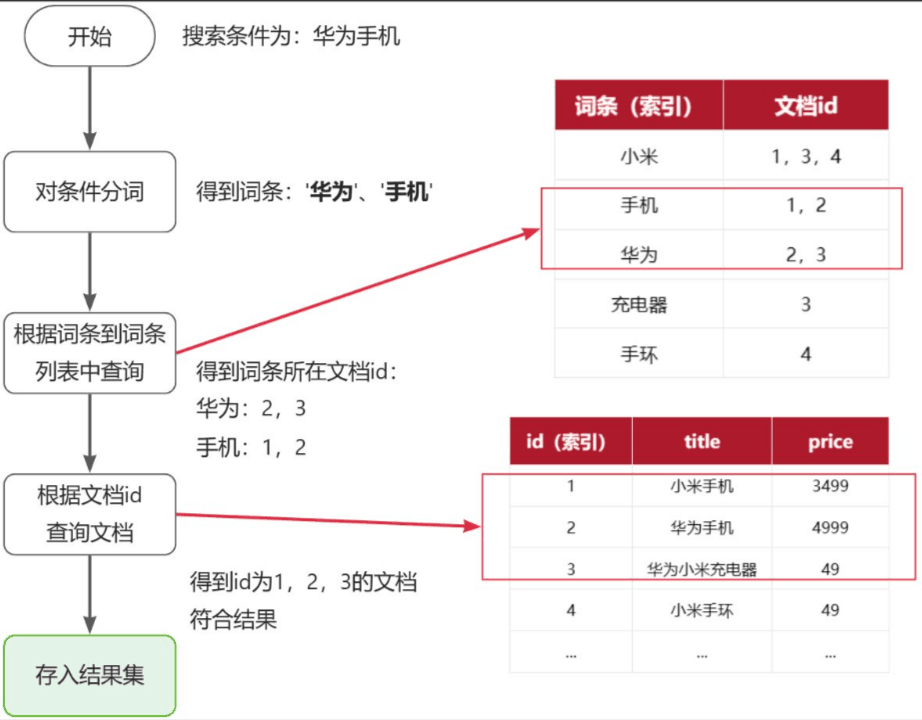<br>
</div>

Process description:<br>

1. User enters "Huawei phone" as search condition.<br>
2. Segment user input condition, obtaining terms: Huawei, phone.<br>
3. Search with terms in the inverted index (because terms have index, query efficiency is high), obtain document ids containing terms: 1, 2, 3.<br>
4. Use document ids to search for specific documents in the forward index (because id also has index, query efficiency is also high).<br>
